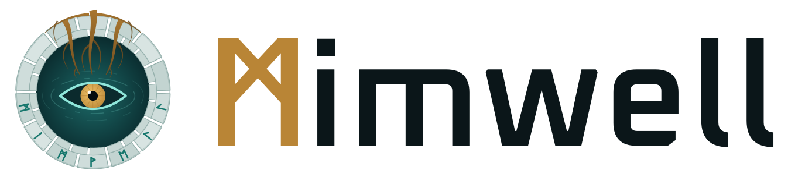

<p align="center">
  <picture>
    <source media="(prefers-color-scheme: dark)" srcset="assets/brand/mimwell-lockup-horizontal-dark.svg">
    
  </picture>
</p>

# Mimwell

Mimwell is a knowledge brain you run yourself. It compiles documents, decisions,
plans and records into one graph and search index. A portal serves that graph to
people, and a retrieval agent answers from it.

The name comes from Mímir's well, the spring under the world tree whose water held
wisdom and memory. Mimwell does the same job for a team: it keeps what the team
learned somewhere anyone can draw from.

This tree ships the portal, the graph compiler and the shared Python runtime,
with empty instance data. The engine sources come from the exact revision
recorded in `edition.json`.

## Quick start

You need Python 3.14, Node 22 and the Wrangler CLI.

```sh
python3 -m pip install -r requirements.txt
npm ci
make verify    # build the empty brain and run its smoke tests
npm run dev    # preview the portal locally through Wrangler
```

Configure authentication and your own hostname before you deploy. No deployment
workflow or account credentials are included.

## Make it yours

- Edit `client.config.json` for the name, colors, fonts, marks, pages and
  authorized knowledge sources. Mimwell's own mark lives in `assets/brand/`;
  point `branding.owner` and `branding.heroMark` at your artwork to replace it.
- Add documents under `knowledge/docs/`, fill the empty records under `app/`,
  and run `make build`. The generated graph and search files are projections,
  so edit their inputs, not the outputs.
- The Easy view is the default home. Readers can switch to the Advanced view,
  and the choice is remembered.
- The sensemaking workbench (concepts, evidence, assessments and strategic maps)
  is opt-in. Add `sensemaking` to `profile.overlays` in `client.config.json`
  to compose its record kinds and show its page.
- Brain apps are small, sandboxed apps served by an authenticated app host.
  Scaffold one with `python3 scripts/new-brain-app.py --id <app-id>` and check it with
  `python3 scripts/check-brain-apps.py`.

Shared consumers may import `knowledge_operations`, `intake_host`, `ontology`
and the context modules from `scripts/`. Governed writes need an explicit host
configuration, authority, policy and authenticated identity. The optional native
sources under `runtime/` need their own toolchains and third-party license
review. No classifier models are bundled.

See [edition boundaries](docs/edition-boundaries.md) for what this edition
supports and what it leaves out.

## License

Mimwell is licensed under the [Apache License, Version 2.0](LICENSE). See
[NOTICE](NOTICE).

The wordmark is drawn from outlines of the Oxanium typeface, licensed under the
SIL Open Font License 1.1 ([assets/brand/OFL-Oxanium.txt](assets/brand/OFL-Oxanium.txt)).

## About

<p>
  <a href="https://conflicthq.com">
    <picture>
      <source media="(prefers-color-scheme: dark)" srcset=".github/assets/conflict-logo-dark.svg">
      
    </picture>
  </a>
</p>

Mimwell is built by [CONFLICT](https://conflicthq.com), a software studio that
builds AI and cloud products. The CONFLICT logo appears in this README only; it
is not part of the Mimwell install.
