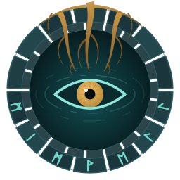
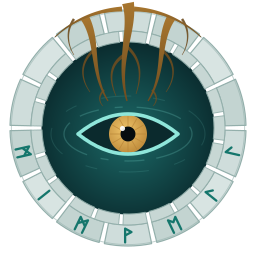
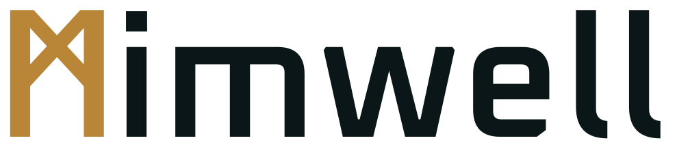

<h1 class="mw-wordmark"></h1>

A mind palaceknowledge basecontext storesecond brainbrainmind palace, knowledge base and context store for people, teams and agents.

[Get started](getting-started/installation.md){ .md-button .md-button--primary }
[View on GitHub](https://github.com/ConflictHQ/mimwell){ .md-button }

ᛗᛁᛗᚹᛖᛚᛚ

Mimwell is a mind palace you run yourself: an open-source knowledge base and context store. It compiles your documents,
decisions, plans and records into one graph and search index. A portal serves
that graph to people, and a retrieval agent answers questions from it.

The name comes from Mímir's well, the spring under the world tree whose water
held wisdom and memory. Mimwell does the same job for a team: it keeps what the
team learned somewhere anyone can draw from.

## What is a mind palace?

It is the oldest memory trick there is. Greek and Roman orators placed each
thing they wanted to remember in a room of an imagined building, then walked
through it to recall. Mimwell builds that palace for a team and its AI agents:
every document, decision and plan gets a place, and anyone can walk in and find
it.

## Build one for

- **Companies and organizations:** strategy, decisions and how things work.
- **Departments and teams:** plans, owners, open questions and handoffs.
- **Projects:** scope, commitments, risks and what changed.
- **Courses and topics:** a curated body of knowledge people can explore.
- **AI development:** grounded context for coding agents and AI apps.

## Why you want one

- **Nothing important gets lost.** Decisions keep their reasons and their
  sources, so the next person finds the why, not only the what.
- **One place to ask.** Search and chat answer from your own material, with
  citations back to the source.
- **Faster onboarding.** New people read the palace instead of interviewing
  everyone.

## Built for AI development

- **A context store your agents can read.** The same graph and search index the
  portal serves are there for coding agents and AI apps, so they work from your
  real decisions and docs instead of guessing.
- **Grounded answers.** The retrieval agent answers from the palace's own
  content and cites it, which keeps answers tied to what you wrote.
- **Scoped access.** Per-path read rules apply to pages, search and agent
  answers alike, and fail closed.
- **Reproducible context.** The build is deterministic, so the same sources
  always give agents the same context.
- **Curated, not dumped.** Suggested connections land in a review queue, and
  nothing becomes part of the palace until someone accepts it.

## What you get

- **A compiled brain.** Markdown documents and structured records build into a
  knowledge graph, a search pack and a manifest. The build is deterministic, so
  the same inputs always produce the same outputs.
- **A portal.** A static site served by a Cloudflare Worker, with an Easy view
  for readers and an Advanced view for people who want every record kind, the
  graph and the sources.
- **A retrieval agent.** Chat that answers from the brain's own content and
  cites its sources.
- **Your brand.** Name, colors, fonts and marks come from one config file.
- **Access control.** Optional per-path read scoping behind Cloudflare Access,
  enforced on every page, search result and agent answer. It fails closed.
- **Brain apps.** Small, sandboxed apps that run beside the portal.
- **Sensemaking.** An opt-in workbench for concepts, evidence, assessments and
  strategic maps.

## Where to go next

- [Installation](getting-started/installation.md): what you need on your machine.
- [Quick start](getting-started/quickstart.md): build and preview your first brain.
- [Concepts](concepts.md): how a brain is put together.
- [Configuration](configuration.md): make it yours.
- [Deploying](deploying.md): put it on your own domain.

Mimwell is open source under the [Apache License 2.0](license.md), built by
[CONFLICT](about.md).
